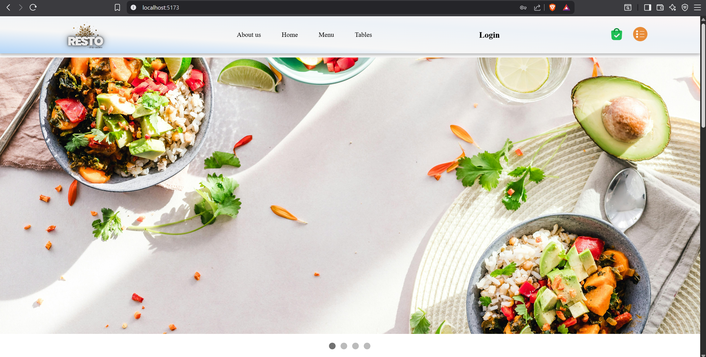
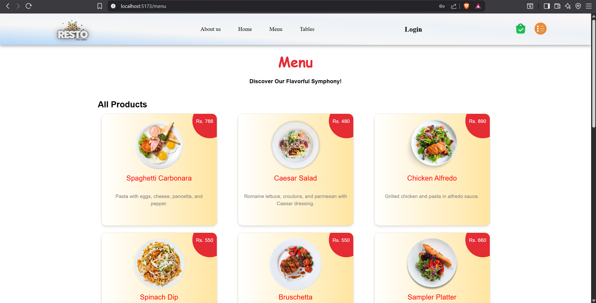
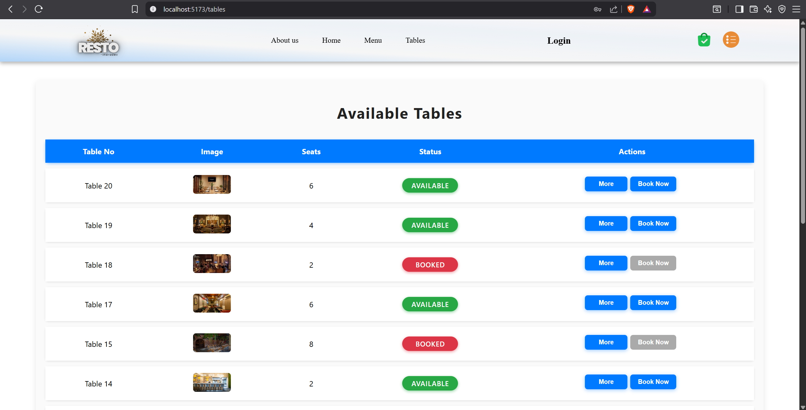
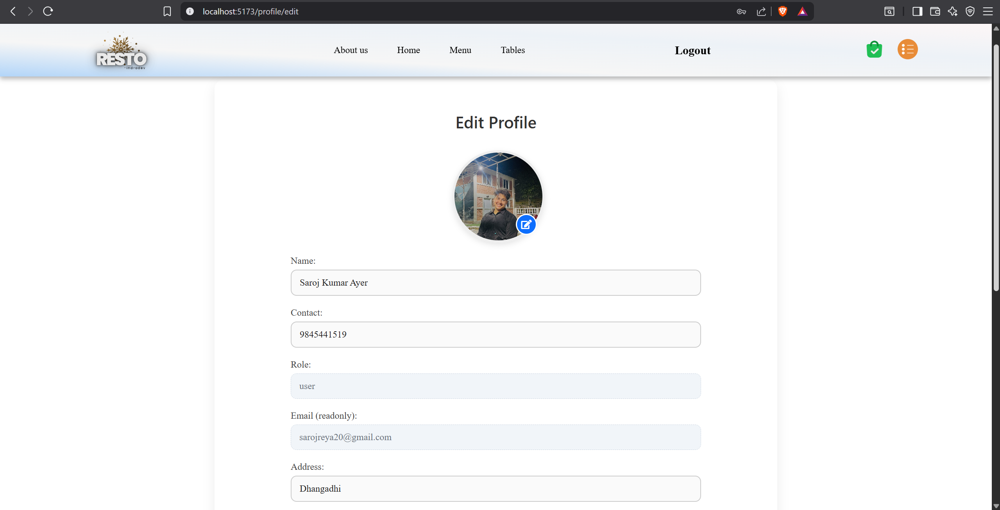

# 🍽️ Casual Dining Reservation System  

A **modern full-stack web application** for casual dining restaurants that enables customers to browse menus, book tables online, and manage reservations, while providing administrators with powerful tools to manage tables, menu items, users, and bookings.  

Built with:  
- **Frontend:** React (Vite, Tailwind, React Router, Recharts, React Toastify)  
- **Backend:** Node.js, Express, PostgreSQL  
- **Authentication:** JWT-based authentication and role-based access control  
- **Other Tools:** Multer (file uploads), Nodemailer (email notifications), Jest & Supertest (testing)  

---

## ✨ Features  

### 👨‍🍳 For Customers  
- 📖 Browse menu items with details (name, description, price, images)  
- 🔑 Secure user registration and login  
- 🖼️ Profile management with profile image upload  
- 🪑 View real-time table availability  
- 📅 Reserve, modify, or cancel bookings  

### 🛠️ For Admins  
- 📊 Dashboard with management tools  
- 🍔 Add, edit, delete menu products  
- 🪑 Manage tables (add, update, set availability)  
- 📌 Oversee all customer bookings (confirm/cancel)  
- 👥 Manage user accounts  
- 📈 Data visualization (booking trends, popular menu items)  

### 🔒 Security  
- 👮 Role-based access control (User/Admin)  
- 🛡️ JWT authentication  
- 🚫 Protection against SQL Injection & XSS  

### 🌐 Non-Functional  
- 📱 Responsive design across devices  
- ⚡ Scalable & maintainable modular architecture  
- 🌍 Cross-browser compatibility  

---

## 📂 Project Structure  
```
src/
│── assets/ # Static assets
│── backend/ # Backend code
│ ├── controllers/ # Business logic
│ ├── database/ # DB connection & models
│ ├── middleware/ # Auth & error handlers
│ ├── routes/ # Express routes
│ ├── tests/ # Jest & Supertest
│ ├── uploads/ # Uploaded files
│ └── index.js # Backend entry point
│
│── css/ # Stylesheets
│── data/ # Local data files
│── public/ # Public assets
│── components/ # Reusable UI components
│── pages/ # React pages
│── App.jsx # Main React app
│── main.jsx # React entry point
│
├── .env # Environment variables
├── package.json # Dependencies & scripts
├── vite.config.js # Vite configuration
└── README.md # Project documentation

```
---

## ⚙️ Environment Setup

### Backend (.env)
```
DB_USER=postgres
DB_HOST=localhost
DB_NAME=resto
DB_PASSWORD=mysecurepass123
DB_PORT=5432
PORT=5000
JWT_SECRET=mysecretkeyisverylongandsecure

EMAIL_USERNAME=your-email@gmail.com

EMAIL_PASSWORD=your-app-password
CLIENT_URL=http://localhost:5173
```

###  Setup
```bash
# Install all dependencies
npm install

# Start frontend development server
npm run dev:frontend

# Start backend server
npm start
```
## 🗄️ Database Tables
### 1. resto_users – Customers / Users
| Column              | Type               | Description                   |
| ------------------- | ------------------ | ----------------------------- |
| user\_id            | SERIAL PRIMARY KEY | Unique user ID                |
| name                | VARCHAR            | Full name                     |
| email               | VARCHAR UNIQUE     | Gmail-only enforced           |
| password            | VARCHAR            | Hashed password               |
| role                | VARCHAR            | 'user', 'admin', 'staff'      |
| contact             | VARCHAR            | 10-digit phone number         |
| address             | TEXT               | Optional user address         |
| profile\_image\_url | TEXT               | Optional avatar/profile image |
| created\_at         | TIMESTAMP          | Default NOW()                 |
| updated\_at         | TIMESTAMP          | Default NOW()                 |

### resto_admins – Admin accounts
| Column      | Type               | Description         |
| ----------- | ------------------ | ------------------- |
| id          | SERIAL PRIMARY KEY | Admin ID            |
| username    | VARCHAR            | Admin username      |
| email       | VARCHAR UNIQUE     | Gmail-only enforced |
| password    | VARCHAR            | Should be hashed    |
| created\_at | TIMESTAMP          | Default NOW()       |
| updated\_at | TIMESTAMP          | Default NOW()       |

### 3. resto_products – Menu items
| Column      | Type               | Description         |
| ----------- | ------------------ | ------------------- |
| id          | SERIAL PRIMARY KEY | Product ID          |
| name        | VARCHAR            | Product name        |
| description | TEXT               | Product description |
| price       | NUMERIC            | Product price       |
| image\_url  | TEXT               | Optional image path |
| created\_at | TIMESTAMP          | Default NOW()       |
| updated\_at | TIMESTAMP          | Default NOW()       |

### 4. restaurant_tables – Restaurant tables
| Column      | Type               | Description                     |
| ----------- | ------------------ | ------------------------------- |
| id          | SERIAL PRIMARY KEY | Table ID                        |
| name        | VARCHAR            | Table label / name              |
| seats       | INTEGER            | Number of seats                 |
| location    | VARCHAR            | Optional location / zone        |
| description | TEXT               | Optional description            |
| image\_url  | TEXT               | Optional image                  |
| status      | VARCHAR            | 'For Booking', 'Occupied', etc. |
| created\_at | TIMESTAMP          | Default NOW()                   |
| updated\_at | TIMESTAMP          | Default NOW()                   |

### 5. bookings – Table reservations
| Column      | Type               | Description                    |
| ----------- | ------------------ | ------------------------------ |
| id          | SERIAL PRIMARY KEY | Booking ID                     |
| table\_id   | INTEGER            | FK → restaurant\_tables.id     |
| user\_id    | INTEGER            | FK → resto\_users.user\_id     |
| name        | VARCHAR            | Customer name                  |
| phone       | VARCHAR            | Contact number                 |
| date        | DATE               | Booking date                   |
| time        | TIME               | Booking time                   |
| created\_at | TIMESTAMP          | Default NOW()                  |
| updated\_at | TIMESTAMP          | Default NOW()                  |

### 6. recent_activities – Activity log
| Column      | Type               | Description                           |
| ----------- | ------------------ | ------------------------------------- |
| id          | SERIAL PRIMARY KEY | Activity ID                           |
| type        | VARCHAR            | 'user', 'booking', 'product', 'table' |
| message     | TEXT               | Activity description                  |
| created\_at | TIMESTAMP          | Default NOW()                         |

### 7. orders – Customer orders
| Column      | Type               | Description                    |
| ----------- | ------------------ | ------------------------------ |
| id          | SERIAL PRIMARY KEY | Order ID                       |
| user\_id    | INTEGER            | FK → resto\_users.user\_id     |
| booking\_id | INTEGER            | Nullable FK → bookings.id      |
| total       | NUMERIC            | Total order amount             |
| created\_at | TIMESTAMP          | Default NOW()                  |
| updated\_at | TIMESTAMP          | Default NOW()                  |

### 9. order_items – Items inside an order
| Column         | Type               | Description             |
| -------------- | ------------------ | ----------------------- |
| id             | SERIAL PRIMARY KEY | Order item ID           |
| order\_id      | INTEGER            | FK → orders.id          |
| created\_at    | TIMESTAMP          | Default NOW()           |

## Screenshots
 
 
 
 


## Video Demo link
Check out the demo video: [Watch on YouTube](https://youtu.be/7GpVGYPjNtk?si=hRCpPw6amP84KPPL)
